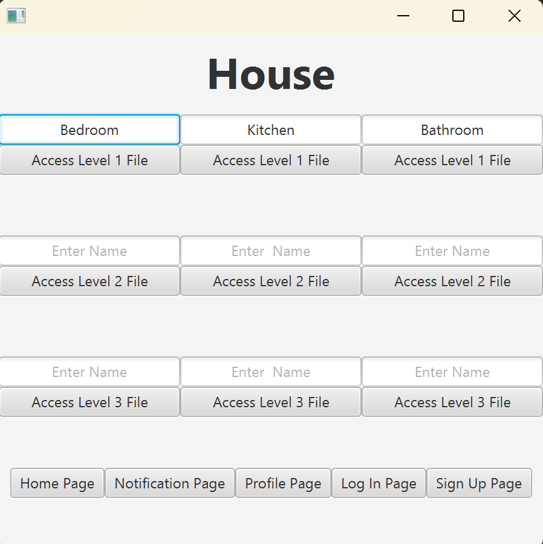

# 📁 Digital Storage System

A JavaFX desktop application that helps users manage and organize their personal files in a simple, user-friendly interface. This app allows users to create and open virtual files, save data across different pages, and navigate between multiple sections such as Home, Files, Notifications, and Profile. Built with JavaFX and FXML, this project focuses on clean architecture, persistence, and usability.

---

## 📝 Summary

- Users can create or open virtual files that launch in their system's default text editor.
- Each user has their own login credentials, which store profile data and file information.
- Changes on each page (like file names, notifications, or profile updates) are stored in a centralized data model and persist as users navigate.
- The UI is split into four main sections: **Home Page**, **5 Built In Files Pages**, **Notification Page**, and **Profile Page**.

---

##  How to Use (with Screenshots)

### 🔐 1. Log In or Create an Account
Enter a username and password to log in or create a new user profile.

---

### 🏠 2. View Your File Dashboard (Home Page)
Click "Home Page" to see a snapshot of your most recent files. This data is pulled from the shared data model.

### 📁 3. Create or Open a File
Click **Open File**, then enter a file name, and click "Access File". If the file doesn't exist, it will be created and opened.

---

### 🔔 4. Check Notifications
Notifications can be added along with the set date.

---

### 👤 5. View and Update Your Profile
Change your password or view your profile information. Changes sync automatically with the system.

---

